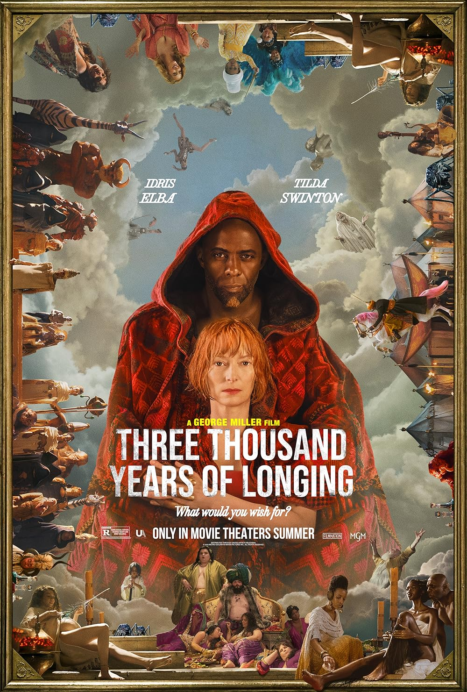
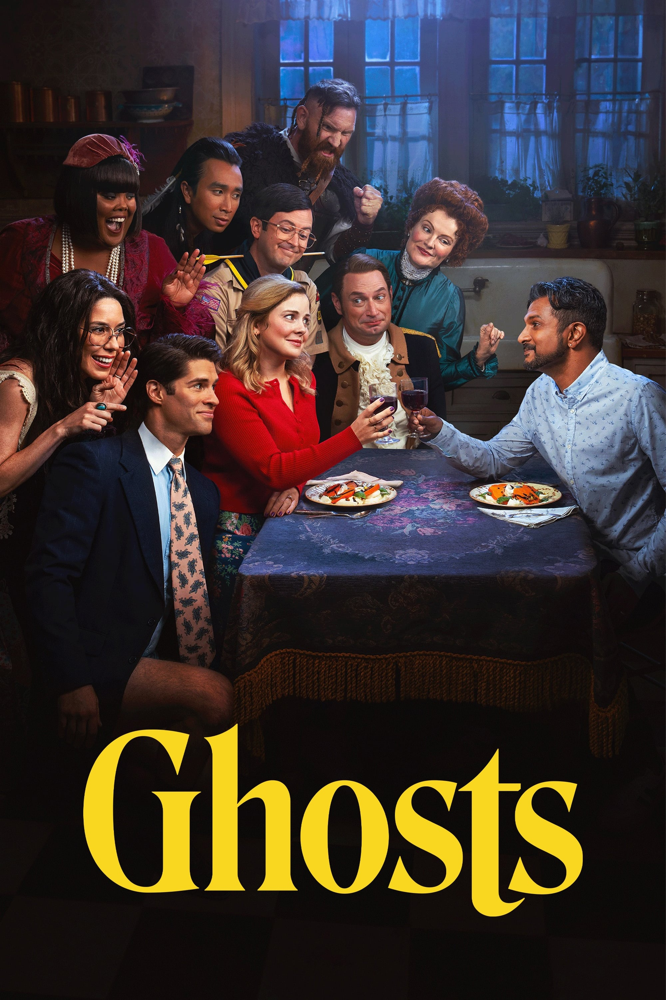
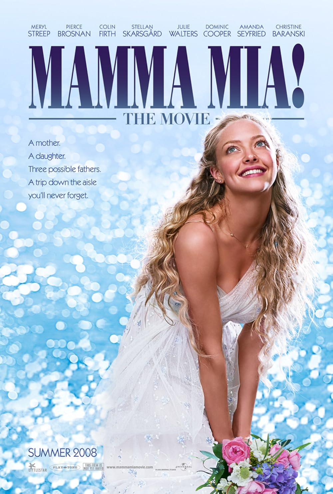

# NetFlix_Clone
## Date: 09-07-2025
## Objective:
To create a modern, responsive navigation bar using CSS Flexbox, mimicking real-world websites like Netflix. This helps reinforce alignment, spacing, and layout structuring using Flexbox properties.

## Tasks:

#### 1. Structure the HTML Layout:
Use a ```<nav>``` tag as the main container.

Add a brand logo/title on the left using a ```<div> or <h1>```.

Add navigation links like Home, Menu, About, Contact, and Login using a ```<ul> with <li> and <a>```.

#### 2. Apply Flexbox for Layout:
Use display: flex on the ```<nav>``` container.

Use justify-content: space-between to align the logo and menu.

Use align-items: center to vertically center both sections.

Style list items with horizontal spacing using gap or margin.

#### 3. Style Like a Real-World Navbar:
Add background color (e.g., dark or gradient like Netflix/Zomato).

Style text with bold fonts, hover effects, and link styling.

Remove default ul and li styles (list-style: none, text-decoration: none).

#### 4. Bonus Enhancements:
Add a hover underline or button effect on links.

Make it responsive using flex-wrap or media queries.

Fix the nav bar to top with position: sticky.


## HTML Code:
```
<!DOCTYPE html>
<html lang="en">
<head>
  <meta charset="UTF-8">
  <title>Netflix Navbar Clone</title>
  <link rel="stylesheet" href="styles.css">
</head>
<body>

  <nav>
    <div class="logo">NETFLIX</div>
    <ul class="nav-links">
      <li><a href="#">Home</a></li>
      <li><a href="#">Menu</a></li>
      <li><a href="#">About</a></li>
      <li><a href="#">Contact</a></li>
      <li><a href="#">Login</a></li>
    </ul>
  </nav>

  <div class="container">
    <div class="thumbnail">
      <div class="thumbnail-text">
        <h1>HOUSE MD</h1>
        <h4>Thriller | Medical Drama</h4>
        <br>
        <div class="buttons">
        <button type="button" class="b" value="Play">Play</button>
         <button type="button" class="b" value="More Info">More Info</button>
         </div>
      </div>
    </div>

    <div class="cards-container"></div>
    <div class="show-cards">
        <div class="card">
            
            <h3>Alice in Borderland</h3>
        </div>

        <div class="card">
            
            <h3>Three Thousand Years of Longing</h3>
        </div>

        <div class="card">
            
            <h3>Ghosts US</h3>
        </div>

        <div class="card">
            
            <h3>The Last of Us</h3>
        </div>

        <div class="card">
            
            <h3>All of Us Are Dead</h3>
        </div>

        <div class="card">
            
            <h3>Mamma Mia</h3>
        </div>

        <div class="card">
            
            <h3>Fear Street 1997</h3>
        </div>    
        </div>
    </div>
    </div>
  </div>


</body>
</html>

```


## CSS Code:
```
* {
  margin: 0;
  padding: 0;
  box-sizing: border-box;
}

body {
  background-color: #111;
  font-family: 'Segoe UI', Tahoma, Geneva, Verdana, sans-serif;
  color: white;
  overflow-y: scroll;
}

nav {
  display: flex;
  justify-content: space-between;
  align-items: center;
  background-color: #141414;
  padding: 15px 30px;
  top: 0;
  z-index: 1000;
}

.logo {
  font-size: 24px;
  font-weight: bold;
  color: red;
  letter-spacing: 1px;
}

.nav-links {
  list-style: none;
  display: flex;
  gap: 25px;
}

.nav-links li a {
  color: white;
  text-decoration: none;
  font-weight: 500;
}

.nav-links li a:hover {
  border-bottom: 2px solid red;
  padding-bottom: 2px;
}

.thumbnail {
  position: relative;
  display: flex;
  align-items: center;
  height: 75vh;
  background-image: url(thumbnail1.jpg);
  background-size: cover;
  background-position: center;
  background-repeat: no-repeat;
}

.thumbnail::before {
  content:"";
  position: absolute;
  width: 100%;
  height: 100%;
  background: linear-gradient(to right, rgba(0, 0, 0, 0.8) 25%, transparent 75%);
  
}

.thumbnail-text {
  position: relative;
  margin-left: 60px;
  
}

.thumbnail-text h1 {
  font-size: 48px;
  font-weight: bold;
  margin-bottom: 10px;
}

.thumbnail-text h4 {
  font-size: 18px;
  font-weight: 400;
  color: #ccc;
}

.buttons
{
    display:flex;
    justify-content: flex-start;
    gap:20px;

}

.b
{
    border:2px white;
    border-radius:8px;
    padding: 20px;
    
    
}


.show-cards
{
    display:flex;
    justify-content:space-between;
    margin-top:30px;
    margin-left:30px;
    margin-bottom:30px;
    overflow-x:scroll;
    
}

.card{
    background-color: white;
    border: 5px solid white;
    border-radius:8px;
    width:30vh;
    margin-right:20px;
    margin-bottom:40px;
    

}

.cards-container
{
    padding:20px;
}

img
{
    height:40vh;
    padding:20px;
}

h3{
    color:black;
    font-weight:bold;
    text-align:center;
}
```


## Output:


## Result:
A modern, responsive navigation bar using CSS Flexbox, mimicking real-world websites like Netflix. This helps reinforce alignment, spacing, and layout structuring using Flexbox properties is created successfully.
